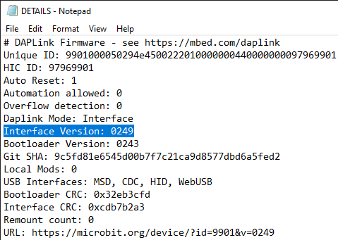

# Getting Started with WebUSB

## What Is WebUSB?

WebUSB is a new up and coming web standard which allows you to access the micro:bit from web pages. WebUSB is only available through Google Chrome from version 65 and above.

## Why is WebUSB Useful?

WebUSB is useful as it allows you to download code to your micro:bit with one click and without needing to navigate to the micro:bit device on your computer.

## How To Setup WebUSB

### Check the micro:bit Firmware version

1. Open the file explorer on your computer
2. Click on the MICROBIT drive
3. Double Click on DETAILS.txt
4. Find interface version within the text file (see image below) if the version number is below 0249 you will need to update the firmware. If your firmware is 0249 or higher go to [pairing your micro:bit](###Pairing)

### Updating the Firmware

1. Put your micro:bit into MAINTENANCE mode. unplug your micro:bit from the computer, hold down the reset button on the back of the micro:bit and plug it back into the computer
2. Download the latest firmware from [microbit.org](microbit.org/get-started/user-guide/firmware) You can read this page for more information about the micro:bit firmware or just scroll down until the Download latest firmware button (see the image below)

[Firmware Download button](FirmwareDownload.png)

3. Once the file has downloaded to your computer, locate it within the file manager and click and drag it to the MAINTENANCE drive. Once the orange LED on the back of the micro:bit has stopped blinking the firmware has been updated the MAINTENANCE drive will disappear and the MICROBIT drive will pop back up.
   
### Pairing Your micro:bit

1. Open [MakeCode](makecode.micro:bit.org)
2. Open a new project
3. Click on the cog in the top right corner next to the Microsoft logo (see the image below)

4. Select pair device and click on the green pair device button
5. Click on the micro:bit name it should look something like the image below

## Making Sure everything Works

To make sure everything works as it should we will create a simple name badge see the code below

Click on the Download button and the code should automatically download straight to the micro:bit.

If you have any problems the micro:bit website has a good troubleshooting guide found here [troubleshooting webUSB](https://makecode.microbit.org/device/usb/webusb/troubleshoot)

Hope you found this guide useful. Let me know in the comments or by email Kerry@raspikidd.com if there are any other guides or micro:bit related things you would like me to take a look at.

